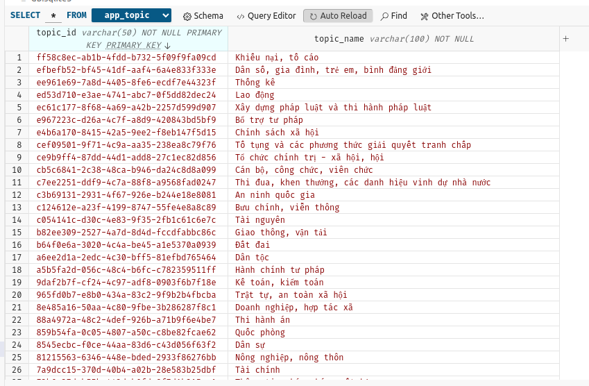
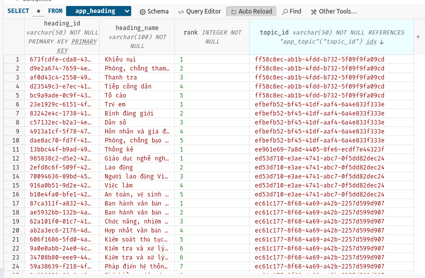
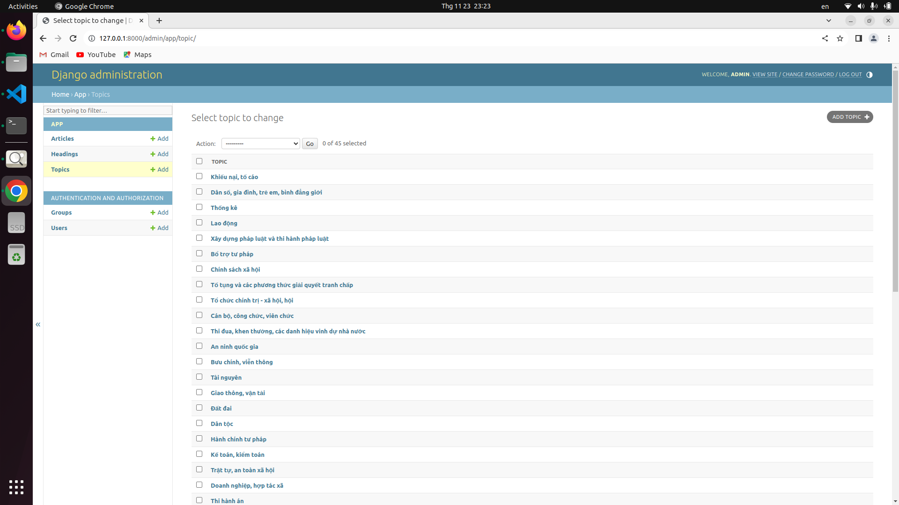
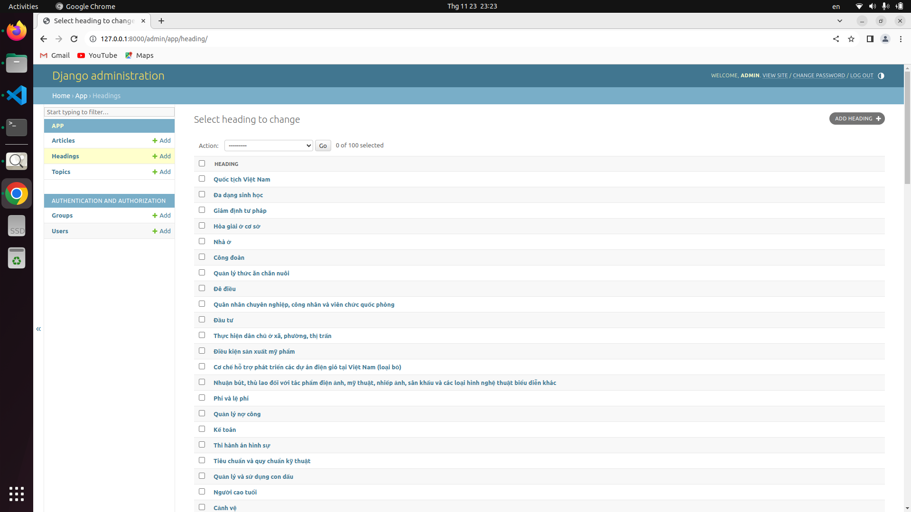
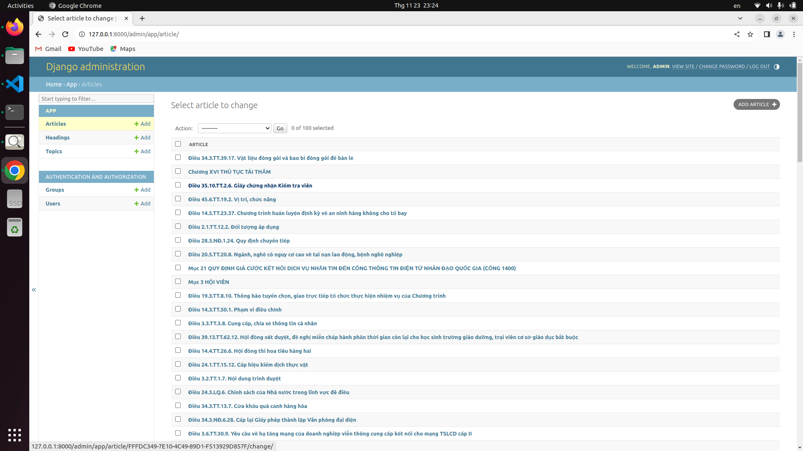
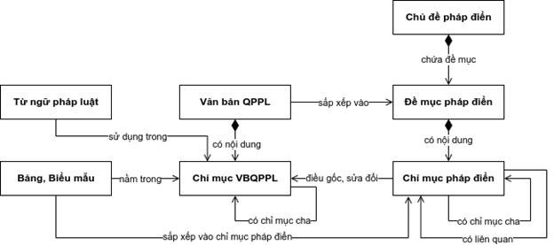

# Phap_dien_VN

<table style="margin: left">
  <tr>
    <td>Python</td>
    <td>3.9</td>
  </tr>
  <tr>
    <td>Django</td>
    <td>4.2.7</td>
  </tr>
  <tr>
    <td>OS</td>
    <td>Ubuntu22.04</td>
  </tr>
</table>


# RUN

## SETUP ENVIRONMENT
```bash
mamba create -n be python=3.9
mamba activate be
mamba install -c conda-forge django -y
```

## RUN PROJECT

```bash
python manage.py makemigrations
python manage.py migrate
python manage.py createsuperuser
```

## INSERT DATABASE

```bash
python static/JSON/database.py
```







## ADMIN SITE

```bash
python manager.py runserver
```








# THIẾT KẾ CƠ SỞ DỮ LIỆU



models Chủ đề
  - id chủ đề
  - name chủ dề

models Đề mục
  - id đề mục
  - name đề mục
  - id chủ đề
  - rank số thứ tự đề mục
  > xem danh mục văn bản
  > xem chi tiết

models chỉ mục
  - id chỉ mục
  - name chỉ mục
  - id đề mục
  - id chỉ mục(chỉ mục con)


class 

- Topics (Chủ đề pháp điển)
- Sub_topic (Đề mục pháp điển)      


# API

--------------------
Endpoint: 

  link: http://127.0.0.1:8000/api/

--------------------
Lấy tất cả các chủ đề

  method: **GET**

  link: http://127.0.0.1:8000/api/topic/

--------------------
Lấy tất cả các đề mục theo chủ đề

  method: **GET**

  link: http://127.0.0.1:8000/api/heading/

```python
params = {
  'id_topic' : 'id topic được lấy từ api chủ đề'
}
```

--------------------
Lấy tất cả các Chương thuộc đề mục

  method: **GET**

  link: http://127.0.0.1:8000/api/article/

```python
params = {
  'id_heading' : 'id của đề mục, cái này được lấy từ api đề mục',
  'id_parent'  : 'null' <-- cái này để mặc định giá trị là null ko thay đổi
}
```

--------------------
Lấy tất cả các điều trong Chương

  method: **GET**

  link: http://127.0.0.1:8000/api/article/

```python
params = {
  'id_heading' : 'id của đề mục, cái này lấy của api đề mục',
  'id_parent'  : 'id của chương, cái này lấy của api chương'
}
```

--------------------
API tìm kiếm thông tin

  method: **POST**

  link: http://127.0.0.1:8000/api/search/

```python
data = {
  "content": "Nội dung"
}
```
--------------------
API Chatbot

  method: **POST**

  link: http://127.0.0.1:8000/api/question/

```python
data = {
  "content" : "Nội dung"
}
```