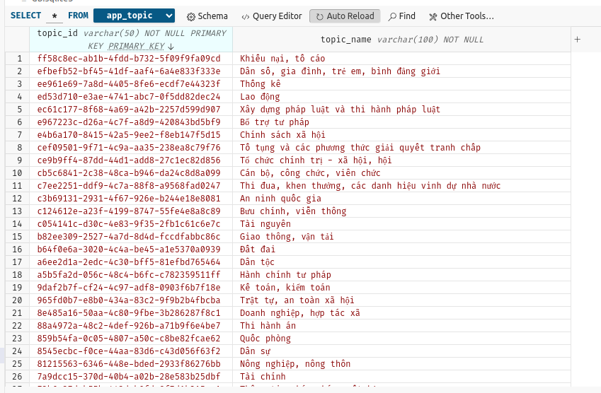
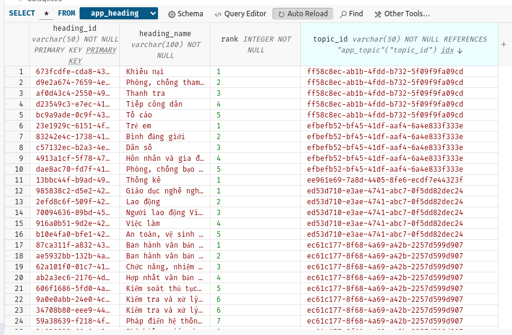
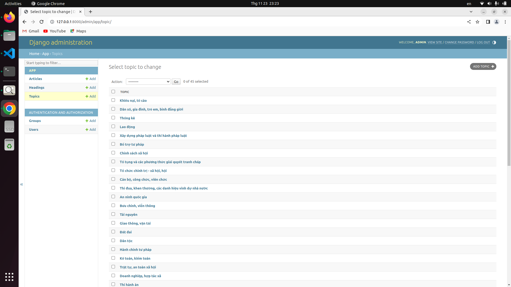
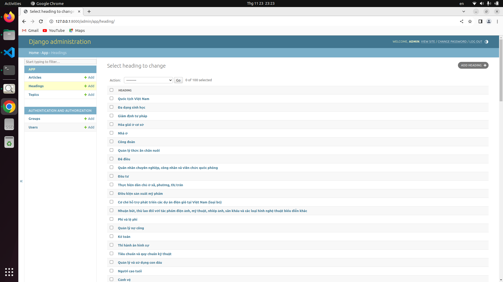
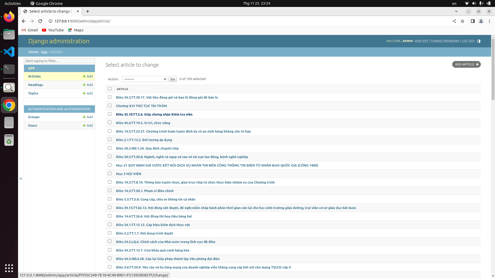
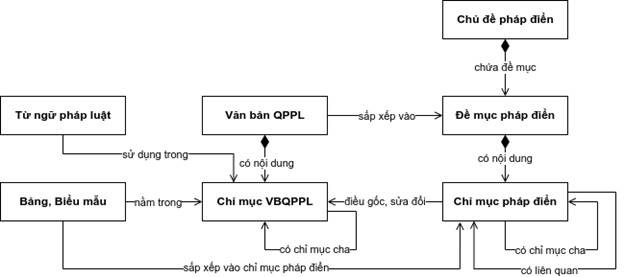

# Phap_dien_VN

<table style="margin: left">
  <tr>
    <td>Python</td>
    <td>3.9</td>
  </tr>
  <tr>
    <td>Django</td>
    <td>4.2.7</td>
  </tr>
  <tr>
    <td>OS</td>
    <td>Ubuntu22.04</td>
  </tr>
</table>


# RUN

## SETUP
```bash
mamba create -n be python=3.9
mamba activate be
mamba install -c conda-forge django -y
```

## RUN PROJECT

```bash
python manager.py makemigrations
python manager.py migrate
python manager.py createsuperuser
```

## INSERT DATABASE

- place 4 path database and jsonfile below

- run file main.py in static/test/ to insert database

```python
database = DatabaseConnection("<path_database>",
                              "<path_topic_json>",
                              "<path_heading_json>",
                              "<path_alltree_json>")

database.insert_topic("app_topic", database.topic_json)
database.insert_heading("app_heading", database.heading_json)
database.insert_article("app_article", database.alltree_json)
```


```bash
python main.py
```







## ADMIN SITE

```bash
python manager.py runserver
```








# THIẾT KẾ CƠ SỞ DỮ LIỆU




class 

- Topics (Chủ đề pháp điển)
- Sub_topic (Đề mục pháp điển)      


# API

--------------------
Endpoint: 

  link: http://127.0.0.1:8000/

--------------------
Get_all Tree: **Method: GET**

  link: http://127.0.0.1:8000/get_tree

--------------------

Search box: **Method: POST**

  link: http://127.0.0.1:8000/search/

  data = {"content": "Nội dung tìm kiếm"}

--------------------

Q and A: **Method: POST**

  link: http://127.0.0.1:8000/qaa/

  data = {"content": "Nội dung câu hỏi"}